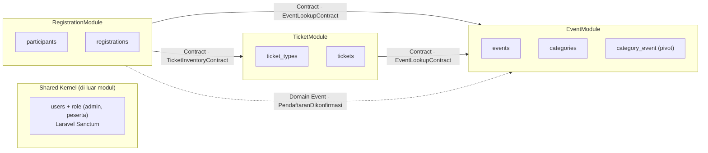

# Bounded Context Diagram

```mermaid
flowchart LR
    subgraph SK["Shared Kernel (di luar modul)"]
        U["users + role (admin, peserta)<br/>Laravel Sanctum"]
    end
    subgraph EM["EventModule"]
        E["events"]
        C["categories"]
        CE["category_event (pivot)"]
    end
    subgraph TM["TicketModule"]
        TT["ticket_types"]
        T["tickets"]
    end
    subgraph RM["RegistrationModule"]
        P["participants"]
        R["registrations"]
    end
    RM -->|"Contract - TicketInventoryContract"| TM
    RM -->|"Contract - EventLookupContract"| EM
    TM -->|"Contract - EventLookupContract"| EM
    RM -.->|"Domain Event - PendaftaranDikonfirmasi"| EM
```

Keterangan:
- Panah tebal adalah pemanggilan lewat Contract (interface).
- Panah putus-putus adalah Domain Event.
- Tidak ada panah dari modul ke tabel modul lain.